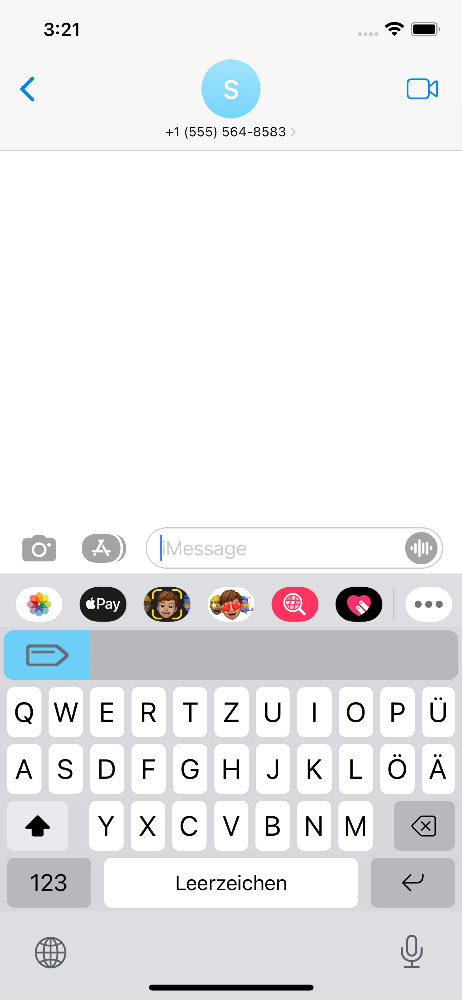
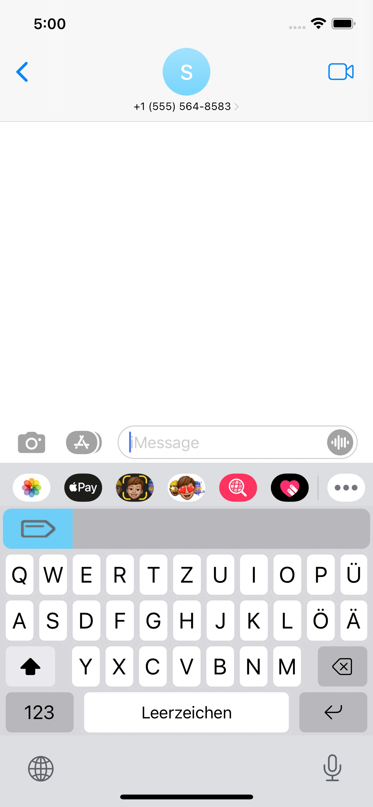
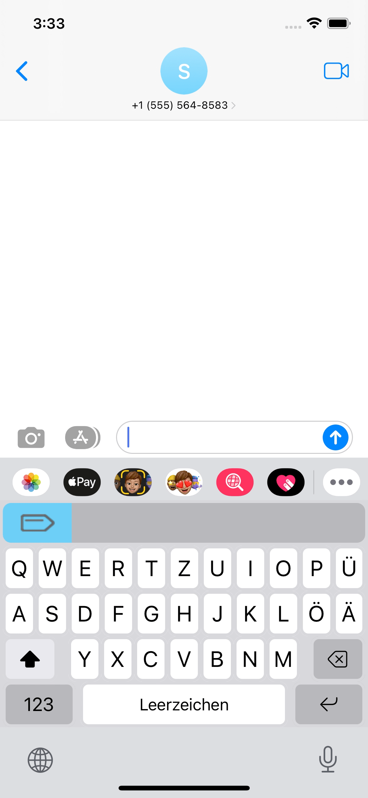

  

---

<!--

-->

NOTE: submission to the App Store in progress.

### Scribe language keyboards for iOS

**Scribe-iOS** is a pack of iOS and iPadOS keyboards for language learners. Features include translation **`(beta)`**, verb conjugation and word annotation that give users the tools needed to communicate with confidence.

Scribe is fully open-source and does not collect usage data or ask for system access. Feature data is sourced from [Wikidata](https://www.wikidata.org/) and stored in-app, meaning Scribe is a highly responsive experience that does not require an internet connection.

# **Contents**

- [Setup](#setup)
- [Features](#features)
  - [Translation](#translation)
  - [Verb Conjugation](#verb-conjugation)
  - [Noun Plurals](#noun-plurals)
  - [Word Annotation](#word-annotation)
  - [Keyboard Functionality](#keyboard-functionality)
- [Supported Languages](#supported-languages)
- [To-Do](#to-do)

# Setup [`⇧`](#contents) 

Users access Scribe language keyboards through the following:

- Download Scribe from the [App Store](https://www.apple.com/app-store/)
- Settings -> General -> Keyboard -> Keyboards -> Add New Keyboard
- Select Scribe and choose from the available language keyboards
- When typing press `🌐` to select keyboards

# Features [`⇧`](#contents) 

Scribe keyboard features are accessed via the `Scribe key` at the top left of any Scribe keyboard. Pressing this key gives the user three new selectable options: `Translate`, `Conjugate` and `Plural`. These keys allow for words to be queried and inserted into the text field followed by a space.

Current features include:

### Translation [`⇧`](#contents) 

The **`beta`** `Translate` feature can translate single words or phrases from English into the language of the current keyboard when the `return` key is pressed.

    <a href="https://github.com/scribe-org/Scribe-iOS/blob/main/Resources/Demos/translation_demo.gif"><kbd></kbd></a>

Those interested in improving this feature can see the [Translation project](https://github.com/scribe-org/Scribe-iOS/projects/1).The goal is to first expand this feature to allow for translations from system and chosen languages. Later `Translate` will provide options for entered words where a user can use grammatical categories and synonyms to select the best option. More advanced methods will be planned and added once this feature is out of **`beta`**.

As of now translations ([P5972](https://www.wikidata.org/wiki/Property:P5972), [Q7553](https://www.wikidata.org/wiki/Q7553)) are not widely available on [Wikidata](https://www.wikidata.org/). The current functionality is thus based on [🤗 Transformers](https://github.com/huggingface/transformers) machine translations of words queried from [Wikidata](https://www.wikidata.org/). Edits to translations.json files are welcome while this feature is in **`beta`**, but the goal is for translations to be directly queried. Furthermore, translating verbs currently requires the user to input `to VERB` so that there is a distinction between verbs and other word forms. This requirement will be removed when later versions change the keyboard display to provide the user with multiple options across grammatical categories.

### Verb Conjugation [`⇧`](#contents) 

With the `Conjugate` feature, a user is presented with the grammar charts for an entered verb instead of the keyboard. Pressing an example in the charts inserts the chosen conjugation into the text field.

    <a href="https://github.com/scribe-org/Scribe-iOS/blob/main/Resources/Demos/conjugation_demo.gif"><kbd></kbd></a>

### Noun Plurals [`⇧`](#contents) 

The `Plural` feature allows a user to enter a noun and then insert its plural when the `return` key is pressed.

    <a href="https://github.com/scribe-org/Scribe-iOS/blob/main/Resources/Demos/noun_plural_demo.gif"><kbd></kbd></a>

### Word Annotation [`⇧`](#contents) 

Scribe further annotates words in the preview bar to help users understand the context of what they're typing. Annotations are displayed once a user has typed a given word and pressed space or by pressing the `Scribe key` while it is selected.

#### Nouns

Scribe annotates nouns in the preview bar according to the following conventions:

- Feminine nouns are colored red 🟥 and marked with (F)
- Masculine nouns are colored blue 🟦 and marked with (M)
- Neutral nouns are colored green 🟩 and marked with (N)
- Plural nouns are colored orange 🟧 and marked with (PL)
- Nouns meeting more than one of the above criteria are marked with all their forms

    <a href="https://github.com/scribe-org/Scribe-iOS/blob/main/Resources/Demos/noun_annotation_demo.gif"><kbd></kbd></a>

#### Prepositions

Scribe also annotates the grammatical cases of prepositions in the preview bar if there is a relation in the given language.

    <a href="https://github.com/scribe-org/Scribe-iOS/blob/main/Resources/Demos/preposition_annotation_demo.gif"><kbd></kbd></a>

### Keyboard Functionality [`⇧`](#contents) 

The goal is for Scribe to have all the functionality of system keyboards. See the [Base Keyboard Features project](https://github.com/scribe-org/Scribe-iOS/projects/6) if interested in helping.

<strong>Current and WIP features</strong>

- iPhone and iPad support
- Dynamic layouts for cross-device performance
- Portrait and landscape modes
- Auto-capitalization
- The double space period shortcut
- Typing `'` returns to the alphabetic keyboard
- Dark mode compatibility
- Hold-to-select characters [(WIP - see project)](https://github.com/scribe-org/Scribe-iOS/projects/2)

# Supported Languages [`⇧`](#contents) 

The Scribe team has interest in creating keyboards for all languages of interest. The following table shows the supported languages and the amount of data available for each on [Wikidata](https://www.wikidata.org/). Based on the available data, the next languages that the Scribe team could focus on are Russian ([queries](https://github.com/scribe-org/Scribe-iOS/blob/main/Data/Russian/), [issue]()) and English ([queries](https://github.com/scribe-org/Scribe-iOS/blob/main/Data/English/), [issue]()).

| Language | Nouns | Verbs | Translations\* | Prepositions† |
| :------- | ----: | ----: | -------------: | ------------: |
| German   |  27K+ |   3K+ |           65K+ |           190 |
| Spanish  |   8K+ |    65 |           65K+ |            NA |

`*` Given the current **`beta`** status where words are machine translated.

`†` Only for languages for which preposition annotation is needed.

# To-Do [`⇧`](#contents) 

Work that is in progress or could be implemented is tracked in the [Issues](https://github.com/scribe-org/Scribe-iOS/issues) and [Projects](https://github.com/scribe-org/Scribe-iOS/projects). Please see the [contribution guidelines](https://github.com/scribe-org/Scribe-iOS/blob/main/.github/CONTRIBUTING.md) if you are interested in contributing to Scribe-iOS. Also note the use of the `--priority--` label that indicates which issues are most important.

Aside from `translations.json` files, Scribe does not accept direct edits to the grammar JSON files as they are sourced from [Wikidata](https://www.wikidata.org/). Edits can be discussed and the queries themselves will be changed and ran before an update. If there is a problem with one of the files, then the fix should be made on [Wikidata](https://www.wikidata.org/) and not on Scribe.

# Powered By

   
  
   

